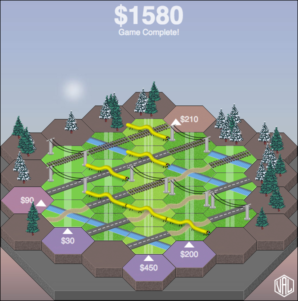

# Hextension (aka HexConnex)

An HTML and JavaScript-based single-player puzzle/strategy game to play in the browser.

Play it [here](https://hexconnex.marthost.uk/), leave feedback on [Itch.io](https://mn3monic.itch.io/hexconnex) or [raise an issue](/issues/).




## Purpose

This repo is non-commercial and is provided as-is for no other purpose than entertainment, education and curiosity. Fork it, play with it, inspect it, but don't do anything that depends on it.


## Technologies used

### Frontend

* [MooTools 1.6](https://mootools.net/core) - the jQuery alternative (includes modules from MooTools More - most notably Draggable)

### Backend

* [Node.js](https://nodejs.org/en/)
* [Express.js](http://expressjs.com/) - serves the highscores API
* [node-persist](https://github.com/simonlast/node-persist) - a lightweight data-store for the highscores


## Installing

### Easy way (frontend only)

Running the game with its backend server is not mandatory. In fact you can run the frontend in standalone mode, by editing `static/js/game.js`:

```
var standalone = true;
```

This disables the AJAX communications between `game.js` and localhost.

Then, just visit `static/index.html` in your web browser.

### Convoluted way (frontend + backend)

Node.js is required.

```
npm install
```
then
```
node server.js
```
then visit `localhost:3000` in your browser.


## Project status

More or less completed, one or two issues outstanding, these may be addressed with time.


## Contributing

This project is not looking for contributions.


## License

This project is licensed under the MIT License.


## Acknowledgments

* [Idea](http://www.abstractstrategy.com/hextension.html) - Spear's Games, 1983
